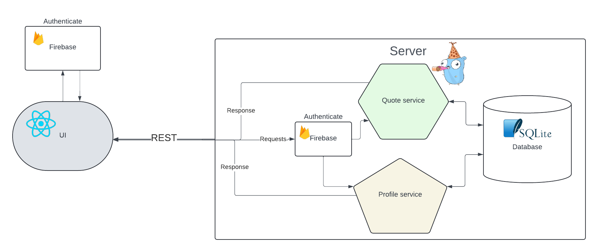

# Fire-Go: Building Simple Modern Go Apps: DDD pattern with Go, Firebase, SQLite



## Overview

Fire-Go is an example application of how to create simple, high-performance applications that are both easy to develop and maintainable in the long run.
   
   - DDD, Modular monolith design
   - REST
   - Go and Gin framework.
   - Sqlite3.
   - Firebase auth with Google Authentication
   - RBAC with firebase
   - Docker deployment
   - Github Actions
   

## Currently working on
This project is still a work in progress, I am looking to add the following features:
- OpenApi Documentation with [huma](https://huma.rocks/)
- Writing unit Tests
- Deploy on Aws with Teraform
- Client with nextjs

<!-- ## Article
This article gives a very detailed guide on this application -->


## Getting Started

To get started with this project, follow these steps:

1. **Clone the git repo**: 
``` yaml
git clone https://github.com/Cprime50/Fire-Go
```

2. **Set Up Firebase Project**: Create a new Firebase project or use an existing one in your [firebase console](https://console.firebase.google.com)

3. **Install the Go dependencys**: cd into project folder and run
```go mod tidy```


6. **Obtain Your Firebase Private Key**:
   - Navigate to the Firebase Console, under project settings, service accounts and download your project's private key.
   - For security, store this key in a `.env` file.

7. **Create .env file**:**Create a `.env` File**:
   - In the root directory of the project, create a `.env` file.
   - Add the following details to the `.env` file:

``` yaml
ADMIN_EMAIL= youremail@mail.com

PORT=:3000

FIREBASE_KEY= your_private_key.json
```

Replace `youremail@mail.com` with your `admin email`, and `path/to/your_private_key.json` with the path to your Firebase private key.

- **Admin Email**: This email will be set as the default admin when authenticated


## Contributing

Contributions are welcome! If you have suggestions for improvements or encounter any issues, please feel free to open an issue or submit a pull request.
